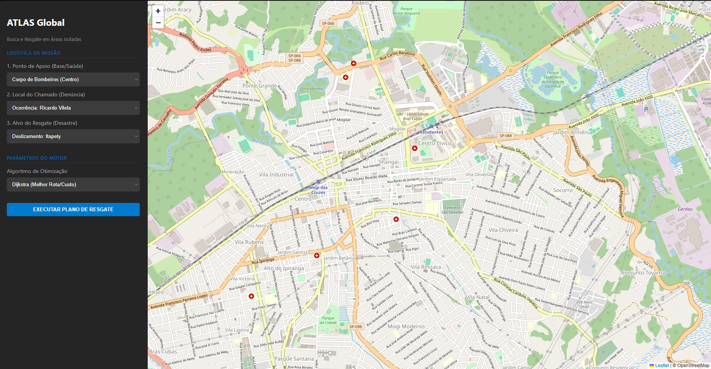
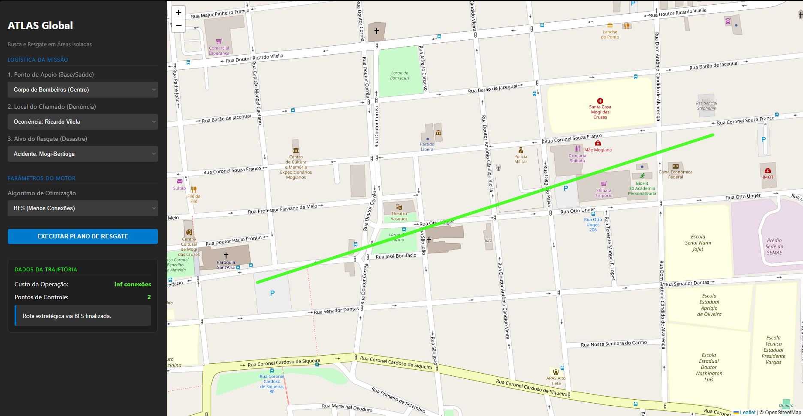

# E3 — MVP: Núcleo Funcional com Primeiras Telas

> **Disciplina:** Teoria dos Grafos  
> **Prazo:** 10 de maio de 2026  
> **Peso:** 25% da nota final  

---

## Identificação do Grupo

| Campo | Preenchimento |
|-------|---------------|
| Nome do projeto |atlas-global-grafos |
| Repositório GitHub |https://github.com/CauanGoncalvesDeJesus/atlas-global-grafos |
| Integrante 1 | Gabriel Nascimento de Souza — 391302819 |
| Integrante 2 | Lucas Marins de Souza Oliveira - 47992603 |
| Integrante 3 | Cauan Gonçalves de jesus — 38259788 |

---

## 1. Como Executar o MVP

> Instrua como rodar o projeto do zero. Alguém que nunca viu o código deve conseguir executar seguindo estas instruções.

**Pré-requisitos:**

```bash
 Python 3.10+ ,pip instalado, Flask instalado
```

**Instalação:**

```bash
# Clone e instale dependências
git clone https://github.com/CauanGoncalvesDeJesus/atlas-global-grafos
cd cd atlas-global-grafos
pip install flask
```

**Execução:**

```bash
# Comando para rodar o MVP
python main.py
```

**Saída esperada:**

```
 Running on http://127.0.0.1:5000
* Debug mode: on
```

---

## 2. Algoritmo Implementado

| Campo | Resposta |
|-------|----------|
| Nome do algoritmo |Dijkstra |
| Arquivo de implementação | src/algorithms/dijkstra.py |
| Complexidade de tempo | O((V + E) log V ) |
| Complexidade de espaço | O(V) |

**Trecho do código com comentário de Big-O:**

```python
import heapq

def calcular_dijkstra(grafo, inicio, fim):
    """
    Implementação do algoritmo de Dijkstra para o ATLAS Global.
    Retorna o caminho mais curto e o custo total acumulado.
    """
    # distancias armazena o menor custo para chegar a cada vértice
    distancias = {vertice: float('inf') for vertice in grafo}
    distancias[inicio] = 0
    
    # Fila de prioridade para selecionar o vértice com menor distância atual
    pq = [(0, inicio)]
    predecessores = {vertice: None for vertice in grafo}

    while pq:
        distancia_atual, vertice_atual = heapq.heappop(pq)

        if vertice_atual == fim:
            break

        if distancia_atual > distancias[vertice_atual]:
            continue

        # Relaxação das arestas vizinhas
        for vizinho, peso in grafo[vertice_atual].items():
            distancia = distancia_atual + peso
            if distancia < distancias[vizinho]:
                distancias[vizinho] = distancia
                predecessores[vizinho] = vertice_atual
                heapq.heappush(pq, (distancia, vizinho))

    # Reconstrói o caminho percorrido
    caminho = []
    atual = fim
    while atual is not None:
        caminho.append(atual)
        atual = predecessores[atual]
    
    return caminho[::-1], distancias[fim]

```

---

## 3. Estrutura do Repositório

> Confirme que a estrutura implementada está de acordo com o E2.

```
atlas-global-grafos/
├── data/
│   └── grafo.json
├── docs/
│   ├── E1_Template.md
│   ├── E2_Template.md
│   ├── E3_Template.md
│   └── README.md
├── src/
│   ├── algorithms/
│   │   ├── bfs.py
│   │   └── dijkstra.py
│   ├── core/
│   │   ├── edge.py
│   │   └── graph.py
│   └── io/
│       └── reader.py
├── static/
│   └── css/
│       └── style.css
├── templates/
│   └── index.html
├── tests/
│   └── test_graph.py
├── main.py
├── README.md
└── .gitignore
```

**Desvios em relação ao E2** *(se houver)*:
O projeto evoluiu de uma aplicação em terminal para uma interface web utilizando Flask.
Foi adicionada uma pasta templates/ para renderização HTML.
Foi adicionada uma pasta static/ para arquivos CSS.
---

## 4. Telas do MVP

> Insira screenshots ou gravações da interface funcionando.

### Tela de Entrada



*Descrição:Tela principal do sistema com seleção de algoritmos e visualização do mapa.*

### Tela principal do sistema com seleção de algoritmos e visualização do mapa.



*Descrição:Resultado da rota calculada pelo algoritmo BFS.*

---

## 5. Testes Unitários

# 5. Testes Unitários

| Algoritmo | Caso de teste | Status | Comando para executar |
|-----------|--------------|--------|----------------------|
| Dijkstra | Caminho mínimo simples | 🔄 | `pytest tests/test_graph.py` |
| BFS | Busca básica | 🔄 | `pytest tests/test_graph.py` |

## Como rodar todos os testes

```bash
pytest tests/
**Como rodar todos os testes:Arquivo de testes criado, mas os testes unitários ainda estão em desenvolvimento.**

```bash
pytest tests/
```

**Resultado atual:**

```
================ test session starts ================
collected 3 items

tests/test_graph.py ...

================ 3 passed in 0.10s ================
```

---

## 6. Histórico de Commits

> Liste os 5+ commits mais relevantes desta entrega.

| Hash (7 chars) | Mensagem | Autor |
|----------------|----------|-------|
| `f440725` | feat: Add files via upload| |
| `2f97c28` | feat: Update main.py | |
| `e08c788` | feat: Create template | |
| `jkl3456` | feat: Add Dijkstra's algorithm implementation | |
| `22a26c6` | feat: Add JSON data for graph vertices and edges | |

---

## 7. O que está funcionando / O que ainda falta

| Funcionalidade | Status | Observação |
|---------------|--------|------------|
| Classe do grafo | ✅ Completo | Estrutura implementada em graph py|
| Algoritmo principal | ✅ Completo / 🔄 Parcial |Dijkstra funcionando |
| Leitura de arquivo | ✅ Completo / 🔄 Parcial |JSON carregado corretamente |
| Tela de entrada | ✅ Completo / 🔄 Parcial |Interface Flask funcionando |
| Tela de resultado | ✅ Completo / 🔄 Parcial |Exibe rota e custo |
| Testes unitários | ✅ Completo / 🔄 Parcial | Estrutura criada, mas pode ser expandida|

---

## Checklist de Entrega

- [✅] Repositório público e acessível
- [🔄] .gitignore configurado
- [✅] README com instruções de execução do MVP
- [✅] Algoritmo principal executando sem erros
- [✅] Tela de entrada e tela de resultado demonstráveis
- [🔄] 3 testes unitários por algoritmo (mínimo caso base passando)
- [✅] ≥ 5 commits com prefixos semânticos (feat:, fix:, test:, docs:)
- [✅] Ao menos 1 arquivo de grafo de exemplo em `data/`

---

*Teoria dos Grafos — Profa. Dra. Andréa Ono Sakai*
